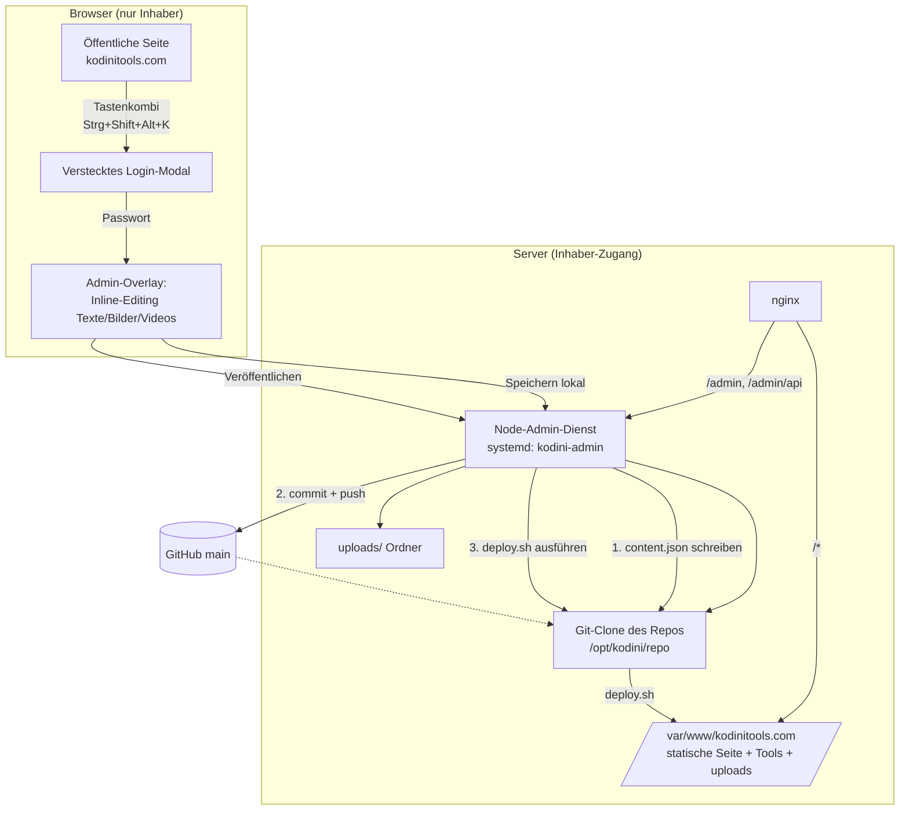

# Plan: Adminbereich + Server-Deploy für kodinitools.com

> Status: **Planung / Vorbereitung** – noch keine Umsetzung.
> Entscheidungen (mit Inhaber abgestimmt):
> 1. **Publish-Flow:** Commit in `main` + Rebuild + Deploy
> 2. **Medien:** Server-Uploads-Ordner (außerhalb Git)
> 3. **Admin-Backend:** Eigener Node-Dienst am Server (systemd) hinter nginx

---

## 1. Ist-Zustand

- **Stack:** Astro 5 + Vue 3 + vue-i18n, statischer Build (`npm run build` → `dist/`).
- **Inhalte** kommen heute aus:
  - `src/locales/de.json` & `src/locales/en.json` (Texte, Tool-Karten, Hero, Footer, `videoShowcase`, FAQ, Blog …) – **Single Source of Truth**, wird beim Build fest eingebacken.
  - `.astro`-Seiten (`src/pages/index.astro`, `faq.astro`, `blog/*`, `en/*`).
  - Bilder/SVGs in `public/image/`.
- **Tool-Apps** (`/audiokonverter/`, `/visualizer/` …) sind **eigenständige Apps**, die *nicht* von Astro gebaut werden. Sie liegen direkt auf dem Server unter `/var/www/kodinitools.com/<tool>/`.
- **Kein Backend, keine CI, kein Deploy-Skript** vorhanden.
- Deploy-Ziel: `/var/www/kodinitools.com` (Inhaber hat Serverzugang).

> ⚠️ **Wichtige Konsequenz:** Der Astro-Build erzeugt nur die "Shell" (Home, Blog, FAQ). Ein naives `rsync --delete dist/ → Webroot` würde **alle Tool-Apps und Uploads löschen**. Das Deploy-Skript muss diese Verzeichnisse zwingend ausschließen (siehe §6).

---

## 2. Zielarchitektur (Überblick)



**Kurzform des Ablaufs beim „Veröffentlichen":**
1. Admin bearbeitet Inhalte im Browser-Overlay → speichert (Zwischenstand am Server).
2. Klick auf **Veröffentlichen**:
   - Backend schreibt geänderte Inhalte in die Content-JSON(s) im Git-Clone.
   - Backend `git commit` + `git push origin main`.
   - Backend ruft `deploy.sh` auf → `git pull`, `npm ci`, `npm run build`, `rsync` nach Webroot (Tools + uploads bleiben erhalten).
3. Nach ~1–2 Min ist die Seite live aktualisiert.

---

## 3. Content-Modell (was wird editierbar?)

Editierbare Inhalte werden in **strukturierten, klar abgegrenzten Content-Dateien** gehalten, damit der Admin sie gefahrlos überschreiben kann, ohne Code anzufassen.

Vorgeschlagene neue Struktur (`src/content/`):

| Datei | Inhalt |
|---|---|
| `src/content/home.de.json` / `home.en.json` | Hero-Titel/-Text/-CTA, `videoShowcase` (Video-URLs/Poster), Promo-Texte |
| `src/content/tools.de.json` / `.en.json` | Tool-Karten (Titel, Beschreibung, Badge, Link) – migriert aus `locales/*.json` |
| `src/content/blog/*.md` (optional Phase 2) | Blog-Artikel als Markdown |
| `public/uploads/…` | Vom Admin hochgeladene Bilder/Videos (Server, außerhalb Git) |

**Migrationsprinzip:** Bestehende `de.json`/`en.json` bleiben zunächst bestehen; nur die tatsächlich editierbaren Felder werden herausgezogen bzw. als „von Admin überschreibbar" markiert. So bleibt die Seite jederzeit lauffähig.

**Editierbare Feldtypen im Admin:**
- **Texte:** Hero, Sektionsüberschriften, Tool-Beschreibungen, Footer, FAQ, Blog.
- **Bilder:** Upload → landet in `public/uploads/…`; Feld speichert Pfad `/uploads/<datei>`.
- **Videos:** Upload (Server-Uploads, ideal für große Dateien) **oder** externe URL (YouTube/Vimeo). Referenz in `videoShowcase`.
- Jedes Feld ist an einen stabilen Schlüssel gebunden (z. B. `hero.title`), damit DE/EN synchron gepflegt werden.

---

## 4. Adminbereich – Frontend

- **Kein sichtbarer Login-Button.** Aktivierung per **Tastenkombination** (Vorschlag: `Strg + Shift + Alt + K`, konfigurierbar). Ein globaler Key-Listener öffnet ein Login-Modal.
- **Login-Modal:** Passwortabfrage → an Backend (`POST /admin/api/login`) → httpOnly-Session-Cookie.
- **Admin-Overlay nach Login:**
  - **Inline-Editing:** editierbare Felder werden markiert (Rahmen/Stift-Icon); Klick → Bearbeiten direkt an Ort und Stelle („Inhalte fixiert auf der Seite").
  - **Medien-Upload:** Drag & Drop für Bilder/Videos.
  - **Sprachumschalter DE/EN** zum parallelen Pflegen.
  - **Zwei Buttons:**
    - *Speichern* → Zwischenstand am Server (noch nicht live).
    - **Veröffentlichen** → Commit in `main` + Rebuild + Deploy (siehe §2).
  - **Status-Anzeige** des Deploys (läuft / fertig / Fehler).
- Umsetzung als kleines Vue-Overlay, das **nur nach erfolgreichem Login** geladen wird (kein Admin-Code im öffentlichen Bundle, das Overlay-Bundle wird lazy über `/admin/api` geladen).

> Hinweis: Die Tastenkombi ist **Bedien-Komfort/Verschleierung**, keine Sicherheit. Die eigentliche Absicherung ist Passwort + Session + Rate-Limiting (§7).

---

## 5. Adminbereich – Backend (Node-Dienst)

- **Laufzeit:** Node (Express oder Fastify), als `systemd`-Dienst `kodini-admin`, lauscht nur lokal (`127.0.0.1:4000`); nginx reverse-proxyt `/admin` und `/admin/api`.
- **Speicherort:** Git-Clone des Repos unter `/opt/kodini/repo` (getrennt vom Webroot). Der Dienst hat Schreibrechte dort + auf `public/uploads` bzw. `/var/www/kodinitools.com/uploads`.
- **API-Endpunkte (Entwurf):**
  | Methode | Pfad | Zweck |
  |---|---|---|
  | `POST` | `/admin/api/login` | Passwort prüfen, Session setzen |
  | `POST` | `/admin/api/logout` | Session beenden |
  | `GET`  | `/admin/api/content` | Aktuelle editierbare Inhalte laden |
  | `PUT`  | `/admin/api/content` | Zwischenstand speichern (Draft) |
  | `POST` | `/admin/api/upload` | Bild/Video hochladen → `/uploads/…` |
  | `POST` | `/admin/api/publish` | Commit → push → `deploy.sh` |
  | `GET`  | `/admin/api/publish/status` | Deploy-Status (Polling/SSE) |
- **Auth:** ein Inhaber-Konto; Passwort als **bcrypt/argon2-Hash** in `.env` (Server, nicht im Git). Session als signiertes httpOnly-Cookie (`Secure`, `SameSite=Strict`), kurze Laufzeit + Verlängerung.
- **Git-Zugriff:** Deploy-Key oder Fine-grained-Token (nur dieses Repo, `contents:write`) im Server-`.env`, damit der Dienst nach `main` pushen kann.
- **Validierung:** Uploads auf Dateityp/Größe prüfen; Content-Writes gegen ein Schema validieren, bevor committet wird.

---

## 6. `deploy.sh` (neu, im Repo-Root)

Wird **auf dem Server** ausgeführt (vom Admin-Dienst *oder* manuell per SSH). Kernlogik:

```bash
#!/usr/bin/env bash
set -euo pipefail

REPO_DIR="/opt/kodini/repo"
WEBROOT="/var/www/kodinitools.com"
BRANCH="main"

cd "$REPO_DIR"

# 1. Neuesten Stand aus main holen
git fetch origin "$BRANCH"
git checkout "$BRANCH"
git reset --hard "origin/$BRANCH"

# 2. Bauen
npm ci
npm run build   # -> dist/

# 3. Nach Webroot spiegeln – ABER Tool-Apps & Uploads NIE löschen
rsync -a --delete \
  --exclude 'uploads/' \
  --exclude '<tool-verzeichnisse…>' \
  dist/ "$WEBROOT/"
```

**Kritische Punkte, die im Skript sauber gelöst werden müssen:**
- **Tool-Apps schützen:** Alle eigenständigen Tool-Ordner (`audiokonverter/`, `visualizer/`, `mp3konverter/`, … – Liste wird aus `de.json`-`link`-Feldern abgeleitet) müssen von `--delete` ausgenommen werden, sonst sind sie nach dem ersten Deploy weg. → Deploy-Skript generiert die Exclude-Liste automatisch aus den `link`-Einträgen.
- **`uploads/` schützen:** Vom `--delete` ausschließen, damit hochgeladene Medien erhalten bleiben.
- **Atomar/rückrollbar (empfohlen):** In ein Release-Verzeichnis bauen und per Symlink umschalten, damit ein fehlgeschlagener Build die Live-Seite nicht beschädigt (optional, Phase 2).
- **Rechte:** korrekte Owner/Permissions für nginx.

Ein manueller Deploy bleibt jederzeit möglich:
```bash
cd /opt/kodini/repo && ./deploy.sh
```

---

## 7. Sicherheit

- Passwort nur als Hash am Server; niemals im Git.
- Session-Cookie `httpOnly` + `Secure` + `SameSite=Strict`.
- **Rate-Limiting** + kurze Sperre nach Fehlversuchen am `/login`.
- `/admin`-Pfade nur über HTTPS; optional zusätzliche nginx-Basisabsicherung (z. B. Zugriff nur nach gesetztem Session-Cookie / IP-Allowlist).
- **Optional (empfohlen) 2FA (TOTP)** für das Inhaber-Konto – deutlich stärker als „versteckte Tastenkombi".
- Upload-Härtung: Whitelist der Dateitypen, Größenlimit, keine Ausführung im Upload-Ordner (nginx `location /uploads` ohne Script-Execution).
- Git-Token minimal scopen (nur dieses Repo).

---

## 8. Umsetzung in Phasen

**Phase 0 – Vorbereitung (dieser Plan).** ✅ Kein Code geändert.

**Phase 1 – Deploy-Grundlage**
- `deploy.sh` schreiben (inkl. Schutz von Tools + uploads).
- Server: nginx-Konfig für `/admin`-Proxy + `/uploads`-Location dokumentieren, systemd-Unit-Vorlage.
- Trockenlauf des Deploys (ohne Admin) verifizieren, dass Tools/Uploads erhalten bleiben.

**Phase 2 – Content-Modell**
- Editierbare Felder in `src/content/*` herausziehen, Seiten darauf umstellen (verhaltensneutral, gleiche Ausgabe).

**Phase 3 – Admin-Backend**
- Node-Dienst mit Auth, Content-API, Upload, Publish + `deploy.sh`-Anbindung.

**Phase 4 – Admin-Frontend**
- Versteckter Combo-Login, Inline-Editing-Overlay, Speichern/Veröffentlichen, Statusanzeige.

**Phase 5 – Härtung & Test**
- Rate-Limit, optional 2FA, End-to-End-Test des Publish-Flows, Rollback testen.

---

## 9. Vom Inhaber benötigt (bevor Umsetzung startet)

- **Server-Infos:** Betriebssystem, Webserver (vermutlich nginx?), Node vorhanden?, wie wird HTTPS bereitgestellt (Let's Encrypt?).
- **Domain für Admin:** unter `kodinitools.com/admin` (empfohlen) oder Subdomain `admin.kodinitools.com`?
- **Git-Zugang am Server:** Deploy-Key/Token zum Pushen nach `main` einrichten.
- **Passwort** für das Inhaber-Konto (wird nur als Hash gespeichert).
- Bestätigung der **Tastenkombination** (Default `Strg+Shift+Alt+K`).
- Freigabe, dass der Server einen **Git-Clone unter `/opt/kodini/repo`** und den **systemd-Dienst** bekommt.

---

## 10. Offene Design-Entscheidungen (später zu klären)

- Atomare Releases mit Symlink-Switch + Rollback ja/nein (Phase 2 optional).
- 2FA (TOTP) aktivieren ja/nein.
- Blog/FAQ ebenfalls voll über Admin editierbar oder vorerst nur Home/Hero/Videos/Tools.
- Automatischer Deploy per GitHub-Webhook bei Push nach `main` zusätzlich zum Admin-Publish?
