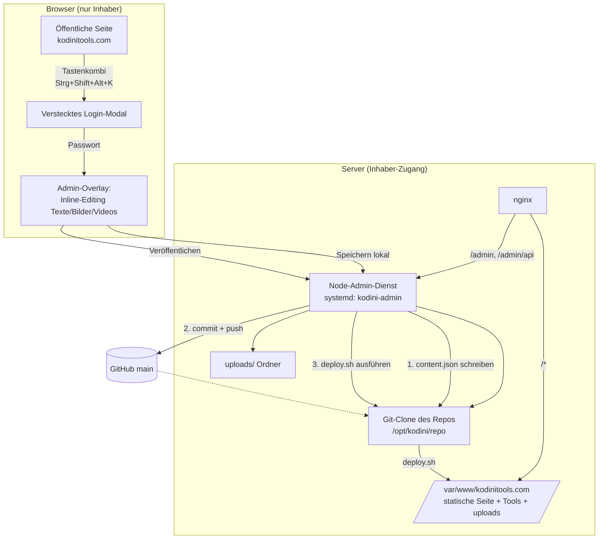

# Plan: Adminbereich + Server-Deploy für kodinitools.com

> Status: **Planung / Vorbereitung** – noch keine Umsetzung.
> Entscheidungen (mit Inhaber abgestimmt):
> 1. **Publish-Flow:** Commit in `main` + Rebuild + Deploy
> 2. **Medien:** Server-Uploads-Ordner (außerhalb Git); Browser-Storage nur als Staging/Vorschau
> 3. **Admin-Backend:** Eigener Node-Dienst am Server (systemd) hinter nginx (`127.0.0.1:9020`)
> 4. **Admin-URL:** `kodinitools.com/admin` (Pfad)
> 5. **Git-Push Server → main:** SSH-Deploy-Key
> 6. **Zusatz-Feature:** Lauftext/Laufband unter der Navigation, im Admin editierbar

---

## 1. Ist-Zustand

- **Stack:** Astro 5 (statische Seiten, Vanilla-JS im Browser), statischer Build (`npm run build` → `dist/`). Die frühere Vue-3-/vue-i18n-Schicht wurde entfernt (ungenutzt).
- **Inhalte** kommen heute aus:
  - `src/locales/de.json` & `src/locales/en.json` (Texte, Tool-Karten, Hero, Footer, `videoShowcase`, FAQ, Blog …) – **Single Source of Truth**, wird beim Build fest eingebacken.
  - `.astro`-Seiten (`src/pages/index.astro`, `faq.astro`, `blog/*`, `en/*`).
  - Bilder/SVGs in `public/image/`.
- **Tool-Apps** (`/audiokonverter/`, `/visualizer/` …) sind **eigenständige Apps**, die *nicht* von Astro gebaut werden. Sie liegen direkt auf dem Server unter `/var/www/kodinitools.com/<tool>/`.
- **Kein Backend, keine CI, kein Deploy-Skript** vorhanden.
- Deploy-Ziel: `/var/www/kodinitools.com` (Inhaber hat Serverzugang).

> ⚠️ **Wichtige Konsequenz:** Der Astro-Build erzeugt nur die "Shell" (Home, Blog, FAQ). Ein naives `rsync --delete dist/ → Webroot` würde **alle Tool-Apps und Uploads löschen**. Das Deploy-Skript muss diese Verzeichnisse zwingend ausschließen (siehe §6).

---

## 2. Zielarchitektur (Überblick)



**Kurzform des Ablaufs beim „Veröffentlichen":**
1. Admin bearbeitet Inhalte im Browser-Overlay → speichert (Zwischenstand am Server).
2. Klick auf **Veröffentlichen**:
   - Backend schreibt geänderte Inhalte in die Content-JSON(s) im Git-Clone.
   - Backend `git commit` + `git push origin main`.
   - Backend ruft `deploy.sh` auf → `git pull`, `npm ci`, `npm run build`, `rsync` nach Webroot (Tools + uploads bleiben erhalten).
3. Nach ~1–2 Min ist die Seite live aktualisiert.

---

## 3. Content-Modell (was wird editierbar?)

Editierbare Inhalte werden in **strukturierten, klar abgegrenzten Content-Dateien** gehalten, damit der Admin sie gefahrlos überschreiben kann, ohne Code anzufassen.

Vorgeschlagene neue Struktur (`src/content/`):

| Datei | Inhalt |
|---|---|
| `src/content/home.de.json` / `home.en.json` | Hero-Titel/-Text/-CTA, `videoShowcase` (Video-URLs/Poster), Promo-Texte |
| `src/content/tools.de.json` / `.en.json` | Tool-Karten (Titel, Beschreibung, Badge, Link) – migriert aus `locales/*.json` |
| `src/content/ticker.de.json` / `ticker.en.json` | **Lauftext-Einträge** (mehrere) für das Laufband unter der Navigation |
| `src/content/blog/*.md` (optional Phase 2) | Blog-Artikel als Markdown |
| `public/uploads/…` | Vom Admin hochgeladene Bilder/Videos (Server, außerhalb Git) |

**Migrationsprinzip:** Bestehende `de.json`/`en.json` bleiben zunächst bestehen; nur die tatsächlich editierbaren Felder werden herausgezogen bzw. als „von Admin überschreibbar" markiert. So bleibt die Seite jederzeit lauffähig.

**Editierbare Feldtypen im Admin:**
- **Texte:** Hero, Sektionsüberschriften, Tool-Beschreibungen, Footer, FAQ, Blog.
- **Lauftext (Laufband):** siehe §3a.
- **Bilder:** Upload → siehe §3b (erst Browser-Storage, beim Veröffentlichen nach `public/uploads/…`); Feld speichert Pfad `/uploads/<datei>`.
- **Videos:** Upload (wie Bilder, Browser-Staging → Server-Uploads, ideal für große Dateien) **oder** externe URL (YouTube/Vimeo). Referenz in `videoShowcase`.
- Jedes Feld ist an einen stabilen Schlüssel gebunden (z. B. `hero.title`), damit DE/EN synchron gepflegt werden.

### 3a. Lauftext / Laufband (neu)

- **Position:** eine horizontale Zeile **direkt unter der Navigation**, über die volle Breite, kontinuierlich laufend (Marquee-Effekt).
- **Mehrere Einträge:** Der Admin pflegt eine **Liste von Text-Einträgen** (plural). Sie laufen nacheinander/aneinandergereiht in einer Zeile durch.
- **Datenmodell** (`src/content/ticker.de.json`):
  ```json
  {
    "enabled": true,
    "speed": "normal",
    "items": [
      { "id": "1", "text": "🎉 Neues Tool: Audio-Normalisierer ist da!", "link": "/audionormalisierer/" },
      { "id": "2", "text": "Alle Tools laufen zu 100 % im Browser – keine Uploads nötig." }
    ]
  }
  ```
- **Editor im Admin:** kleiner Listen-Editor – Einträge hinzufügen/entfernen/sortieren, Text bearbeiten, optionalen Link setzen, DE/EN getrennt, Laufband an-/ausschalten, Geschwindigkeit wählen. Live-Vorschau im Overlay.
- **Rendering:** neue Astro/Vue-Komponente `TickerBar`, eingebunden in `BaseLayout` unter `GlobalNav`; reine CSS-Animation (kein externes Marquee-Plugin), pausiert bei Hover, respektiert `prefers-reduced-motion`.

### 3b. Medien-Upload über Browser-Storage (neu)

Gewünschter Ablauf: **erst lokal im Browser, dann beim Veröffentlichen auf den Server.**

1. **Ablegen im Admin:** Der Admin zieht Bild/Video ins Overlay. Die Datei wird **im Browser-Storage** gehalten:
   - **IndexedDB** (nicht `localStorage`) als Speicher – `localStorage` ist ~5 MB und nur Strings; IndexedDB speichert Blobs und trägt problemlos Videos.
   - Sofortige **Vorschau** über eine `blob:`-URL, **ohne** Server-Round-Trip.
   - Der Draft (inkl. Medien) **übersteht Reload** und kann später weiterbearbeitet werden.
2. **Veröffentlichen:** Beim Klick auf **Veröffentlichen** werden die im Browser-Storage liegenden Medien an das Backend hochgeladen (`POST /admin/api/upload`), landen in `public/uploads/…` (Server, außerhalb Git), und die Content-Referenz `/uploads/<datei>` wird in `main` committet und deployt. Danach werden die lokalen Blobs aus dem Browser-Storage geräumt.

> **Wichtig / zu bestätigen:** Reiner Browser-Storage ist **geräte-/browserlokal** und für andere Besucher unsichtbar. Damit hochgeladene Medien **öffentlich auf der Live-Seite** erscheinen, müssen sie beim Veröffentlichen auf den Server übertragen werden (Schritt 2). Der Browser-Storage dient als **Staging/Vorschau**, nicht als finaler Speicher. Diese Kombination erfüllt beides: lokales Hochladen/Vorschau **und** öffentliche Sichtbarkeit nach dem Veröffentlichen.

---

## 4. Adminbereich – Frontend

- **Kein sichtbarer Login-Button.** Aktivierung per **Tastenkombination** (Vorschlag: `Strg + Shift + Alt + K`, konfigurierbar). Ein globaler Key-Listener öffnet ein Login-Modal.
- **Login-Modal:** Passwortabfrage → an Backend (`POST /admin/api/login`) → httpOnly-Session-Cookie.
- **Admin-Overlay nach Login:**
  - **Inline-Editing:** editierbare Felder werden markiert (Rahmen/Stift-Icon); Klick → Bearbeiten direkt an Ort und Stelle („Inhalte fixiert auf der Seite").
  - **Lauftext-Editor:** Listen-Editor für die Laufband-Einträge unter der Navigation (hinzufügen/sortieren/löschen, Link optional, an/aus, Tempo) mit Live-Vorschau (§3a).
  - **Medien-Upload:** Drag & Drop für Bilder/Videos → zunächst **Browser-Storage (IndexedDB)** als Draft/Vorschau, Upload auf den Server erst beim Veröffentlichen (§3b).
  - **Sprachumschalter DE/EN** zum parallelen Pflegen.
  - **Zwei Buttons:**
    - *Speichern* → Zwischenstand am Server (noch nicht live).
    - **Veröffentlichen** → Commit in `main` + Rebuild + Deploy (siehe §2).
  - **Status-Anzeige** des Deploys (läuft / fertig / Fehler).
- Umsetzung als kleines Vue-Overlay, das **nur nach erfolgreichem Login** geladen wird (kein Admin-Code im öffentlichen Bundle, das Overlay-Bundle wird lazy über `/admin/api` geladen).

> Hinweis: Die Tastenkombi ist **Bedien-Komfort/Verschleierung**, keine Sicherheit. Die eigentliche Absicherung ist Passwort + Session + Rate-Limiting (§7).

---

## 5. Adminbereich – Backend (Node-Dienst)

- **Laufzeit:** Node (Express oder Fastify), als `systemd`-Dienst `kodini-admin`, lauscht nur lokal (`127.0.0.1:9020` — freier Port; belegt sind 3847, 9000, 9001, 9003, 9006–9009, 9013, 9014); nginx reverse-proxyt `/admin` und `/admin/api`.
- **Vorlage vorhanden:** Der bestehende Dienst **`traffic-dashboard`** (Node auf `127.0.0.1:3847`, nginx-Block `/traffic-dashboard/api/` + Frontend aus `dist/`) ist praktisch das gleiche Muster — Admin-Dienst + nginx-Block werden analog gebaut.
- **nginx (neuer Block, analog `traffic-dashboard`, VOR den generischen Astro-Locations einsortiert):**
  ```nginx
  # Admin-API -> Node-Dienst
  location ^~ /admin/api/ {
      proxy_pass http://127.0.0.1:9020/api/;
      proxy_http_version 1.1;
      proxy_set_header Host              $host;
      proxy_set_header X-Real-IP         $remote_addr;
      proxy_set_header X-Forwarded-For   $proxy_add_x_forwarded_for;
      proxy_set_header X-Forwarded-Proto $scheme;
      client_max_body_size 2G;           # große Video-Uploads beim Veröffentlichen
      proxy_request_buffering off;
  }
  # Admin-Frontend (Login/Overlay-Bundle) -> Node-Dienst
  location ^~ /admin/ {
      proxy_pass http://127.0.0.1:9020/;
      proxy_http_version 1.1;
      proxy_set_header Host              $host;
      proxy_set_header X-Forwarded-Proto $scheme;
  }
  ```
- **Speicherort:** Git-Clone des Repos unter `/opt/kodini/repo` (getrennt vom Webroot). Der Dienst hat Schreibrechte dort + auf `public/uploads` bzw. `/var/www/kodinitools.com/uploads`.
- **API-Endpunkte (Entwurf):**
  | Methode | Pfad | Zweck |
  |---|---|---|
  | `POST` | `/admin/api/login` | Passwort prüfen, Session setzen |
  | `POST` | `/admin/api/logout` | Session beenden |
  | `GET`  | `/admin/api/content` | Aktuelle editierbare Inhalte laden |
  | `PUT`  | `/admin/api/content` | Zwischenstand speichern (Draft) |
  | `POST` | `/admin/api/upload` | Bild/Video hochladen → `/uploads/…` |
  | `POST` | `/admin/api/publish` | Commit → push → `deploy.sh` |
  | `GET`  | `/admin/api/publish/status` | Deploy-Status (Polling/SSE) |
- **Auth:** ein Inhaber-Konto; Passwort als **bcrypt/argon2-Hash** in `.env` (Server, nicht im Git). Session als signiertes httpOnly-Cookie (`Secure`, `SameSite=Strict`), kurze Laufzeit + Verlängerung.
- **Git-Zugriff:** Deploy-Key oder Fine-grained-Token (nur dieses Repo, `contents:write`) im Server-`.env`, damit der Dienst nach `main` pushen kann.
- **Validierung:** Uploads auf Dateityp/Größe prüfen; Content-Writes gegen ein Schema validieren, bevor committet wird.

---

## 6. `deploy.sh` (neu, im Repo-Root)

Wird **auf dem Server** ausgeführt (vom Admin-Dienst *oder* manuell per SSH). Kernlogik:

```bash
#!/usr/bin/env bash
set -euo pipefail

REPO_DIR="/opt/kodini/repo"
WEBROOT="/var/www/kodinitools.com"
BRANCH="main"
EXCLUDES="$REPO_DIR/deploy-protect.txt"   # geschützte Pfade, siehe unten

cd "$REPO_DIR"

# 1. Neuesten Stand aus main holen
git fetch origin "$BRANCH"
git checkout "$BRANCH"
git reset --hard "origin/$BRANCH"

# 2. Bauen
npm ci
npm run build   # -> dist/

# 3. Nach Webroot spiegeln – Astro-Dateien aktualisieren/aufräumen,
#    ABER alle eigenständigen Tool-Ordner + uploads NIE anfassen.
rsync -a --delete \
  --exclude-from="$EXCLUDES" \
  dist/ "$WEBROOT/"
```

**Warum eine explizite Schutzliste (`deploy-protect.txt`) statt Auto-Ableitung?**
Der Astro-Build (`dist/`) enthält **nur** die Shell: `index.html`, `en/`, `blog/`, `faq/`, `_astro/`, `404.html` + `public/`-Assets (`image/`, `fonts/`, `fontawesome/`, `partials/`, Favicons, `robots.txt`, `sitemap`). Er enthält **keine** der ~19 eigenständigen Tool-Ordner. Ein `rsync --delete` ohne Schutz würde sie **alle löschen**. Die Verzeichnisnamen weichen teils von den Tool-Links ab (`ultimativer-musikplayer` vs. Link `ultimativermusikplayer`, `playlist_generator`, `kodini-color-extractor`), daher ist eine **gepflegte, reviewbare Liste** sicherer als Auto-Ableitung.

**`deploy-protect.txt` (aus aktueller nginx-Config abgeleitet — im Webroot, aber NICHT aus dem Astro-Build):**

```
uploads/
audionormalisierer/
audiokonverter/
bilderseriebearbeiten/
bildkonverter/
mp3konverter/
alarmtool/
audioequalizer/
modernermusikplayer/
playlist_generator/
ultimativer-musikplayer/
musikvideos/
visualizer/
bildergalerie/
collagemaker/
kodini-color-extractor/
equaliser19/
videokonverter/
playlistkonverter/
kontaktformular/
```

> Hinweise:
> - `en/`, `blog/`, `faq/` werden von Astro erzeugt → **nicht** schützen (sollen aktualisiert werden).
> - `traffic-dashboard` liegt unter `/var/www/traffic-dashboard/` (außerhalb des Webroots) → vom Deploy ohnehin nicht betroffen.
> - Neuer eigenständiger Tool-Ordner künftig? → **eine Zeile** in `deploy-protect.txt` ergänzen.

**Weitere Punkte im Skript:**
- **`uploads/` schützen:** steht in der Liste, damit hochgeladene Medien erhalten bleiben.
- **Trockenlauf zuerst:** erster echter Deploy mit `rsync --dry-run`, um sicherzustellen, dass kein Tool-Ordner in der Lösch-Liste auftaucht.
- **Atomar/rückrollbar (empfohlen):** In ein Release-Verzeichnis bauen und per Symlink umschalten, damit ein fehlgeschlagener Build die Live-Seite nicht beschädigt (optional, Phase 2).
- **Rechte:** korrekte Owner/Permissions für nginx (`www-data`).

Ein manueller Deploy bleibt jederzeit möglich:
```bash
cd /opt/kodini/repo && ./deploy.sh
```

---

## 7. Sicherheit

- Passwort nur als Hash am Server; niemals im Git.
- Session-Cookie `httpOnly` + `Secure` + `SameSite=Strict`.
- **Rate-Limiting** + kurze Sperre nach Fehlversuchen am `/login`.
- `/admin`-Pfade nur über HTTPS; optional zusätzliche nginx-Basisabsicherung (z. B. Zugriff nur nach gesetztem Session-Cookie / IP-Allowlist).
- **Optional (empfohlen) 2FA (TOTP)** für das Inhaber-Konto – deutlich stärker als „versteckte Tastenkombi".
- Upload-Härtung: Whitelist der Dateitypen, Größenlimit, keine Ausführung im Upload-Ordner (nginx `location /uploads` ohne Script-Execution).
- Git-Token minimal scopen (nur dieses Repo).

---

## 8. Umsetzung in Phasen

**Phase 0 – Vorbereitung (dieser Plan).** ✅ Kein Code geändert.

**Phase 1 – Deploy-Grundlage** ✅ *(Dateien im Repo angelegt)*
- `deploy.sh` (Root) — Build aus `main` + rsync mit Schutzliste + automatischer Abbruch, falls ein geschützter Pfad gelöscht würde; `--dry-run` / `--no-pull`.
- `deploy-protect.txt` (Root) — Schutzliste (uploads/ + 19 Tool-Ordner).
- `deploy/kodini-admin.service` — systemd-Unit-Vorlage (Port 9020, gehärtet).
- `deploy/nginx-admin.conf` — nginx-Blöcke `/admin`, `/admin/api`, `/uploads`.
- `deploy/.env.example` — Secrets-Vorlage für `/opt/kodini/.env`.
- `deploy/README.md` — Server-Setup Schritt für Schritt (Clone, Deploy-Key, Dry-Run, systemd, nginx).
- `deploy/setup-server.sh` — **idempotentes Ein-Kommando-Setup** (Service-User-Erkennung, Voraussetzungen, Deploy-Key, Repo-Klon mit repo-lokalem `core.sshCommand`, `.env` + Passwort, systemd-Dienst). Führt durch die manuellen Rest-Schritte (GitHub-Key, nginx, Dry-Run).
- **Noch auf dem Server auszuführen:** `sudo bash deploy/setup-server.sh`, dann nginx-Blöcke einfügen + Trockenlauf (`./deploy.sh --dry-run`).

**Phase 2 – Content-Modell** ✅ *(umgesetzt, verhaltensneutral verifiziert)*
- `src/content/content.ts` — Loader: merged Standard-Locale + `overrides.*.json`, exportiert `getContent()`, `messages`, `getTicker()`.
- `src/content/overrides.de.json` / `overrides.en.json` — leer (`{}`), vom Admin beschreibbar.
- `src/content/ticker.de.json` / `ticker.en.json` — Laufband-Config (`enabled:false`, leer → rendert nichts).
- Seiten umgestellt: `index.astro`, `en/index.astro`, `faq.astro`, `en/faq.astro`, `_app.ts` lesen jetzt über die Content-Schicht.
- `src/content/README.md` — Doku der Schicht + Override-/Ticker-Format.
- **Verifikation:** Build vorher/nachher — alle 21 HTML-Seiten **byte-identisch**, alle referenzierten Assets identisch (einzige Differenz: ein nirgends eingebundener Vue-Orphan-Chunk). Neue Dateien lint- & prettier-sauber.

**Phase 3 – Admin-Backend** ✅ *(umgesetzt & lokal getestet)*
- `server/admin/` — Node-Dienst **ohne externe npm-Deps** (nur Built-ins).
  - `auth.mjs`: scrypt-Passwort, signierte HMAC-Session-Cookies, Login-Bruteforce-Schutz.
  - `content.mjs`: Lesen/Schreiben + Validierung von `overrides.*`/`ticker.*`.
  - `uploads.mjs`: Raw-Body-Upload (`X-Filename`) → `UPLOADS_DIR`, Typ-Whitelist.
  - `publish.mjs`: commit → push → `deploy.sh` (asynchron, Status-Polling).
  - `index.mjs`: HTTP-Server + Routing + statische Auslieferung des Frontends.
  - `hash-password.mjs`: erzeugt `ADMIN_PASSWORD_HASH`. `README.md`: Doku.
- eslint-Override für `server/**/*.mjs` (Node-Globals) ergänzt.
- **Lokal getestet** (curl): Auth, 401 ohne Session, CSRF-403, Speichern (valides JSON), Upload + Namens-Sanitisierung, 415 für `.php`, Ticker-Validierung (400 bei `javascript:`-Link), Logout. *(Publish/Git/Deploy erst auf dem Server testbar.)*

**Phase 3b – Laufband (Ticker)** ✅ *(umgesetzt)*
- `src/components/TickerBar.astro` — CSS-Marquee unter der Navigation, pausiert bei Hover/Focus, respektiert `prefers-reduced-motion`, dark-theme-aware, optionaler Link pro Eintrag, Tempo (slow/normal/fast).
- Eingebunden unter jeder `GlobalNav`: Home (DE/EN), FAQ (DE/EN), Blog-Index (DE/EN), Blog-Artikel-Layout.
- Liest `src/content/ticker.*.json`. Aktuell `enabled:false` / leer → rendert nichts (unsichtbar bis der Admin es aktiviert). Aktiviert-Test verifiziert: Markup, Text und klickbarer Link erscheinen korrekt.

**Phase 4 – Admin-Frontend** ✅ *(umgesetzt & im echten Browser getestet)*
- **Versteckter Login:** Tastenkombi `Strg/Cmd+Shift+Alt+K` in `GlobalNav` (auf jeder Seite) → `/admin/`. Kein sichtbarer Button.
- `server/admin/public/` — eigenständige Vanilla-JS-App (kein Build-Schritt), vom Node-Dienst ausgeliefert:
  - **Laufband-Editor** (DE/EN): Einträge hinzufügen/sortieren/löschen, Link, an/aus, Tempo.
  - **Text-Editor** (DE/EN): Hero-Titel/-Untertitel/-Button, Video-Bereich-Titel/-Untertitel (leer = Standard).
  - **Videos & Medien:** 3 Sektions-Video-Slots + **Medien-Zwischenspeicher via IndexedDB** (Drag&Drop, Vorschau, übersteht Reload) → Upload auf den Server erst beim **Veröffentlichen**.
  - **Erweitert:** roher Overrides-JSON-Editor (Escape-Hatch).
  - **Hintergrund** (global): Seitenhintergrund je Hell-/Dunkelmodus mit Farbe, **Deckkraft** (Mischung mit der Standardfarbe des Modus) und optionalem **Farbverlauf** (Endfarbe, linear mit Richtung oder radial). Speicherort `media.site.bg*` (Suffix `Dark`); Seite rendert `--bg-color` (flache Mischfarbe) plus `body{background:<Ebene>, <Standardfarbe>}` (`content.ts` → `getSiteBackgroundStyle`). Deckend ohne Verlauf bleibt es bei der reinen Variable (kein Regress).
  - **Muster + Hintergrundbild** (im Hintergrund-Tab, je Hell/Dunkel): reines CSS-**Muster** (Punktraster oder feines Gitter; Farbe, Abstand 4–200 px, Stärke 1–6 px, Deckkraft) als wiederholte Gradient-Ebene über der Farbe (`media.site.bgPattern*`); **Hintergrundbild** aus der Mediathek oder per URL (`media.site.bgImage*`) mit Abdunkelung, Weichzeichner, Deckkraft und „fixiert beim Scrollen" (sonst erste Bildschirmhöhe, läuft per Maske aus). Die Seite rendert das Bild als `body::before` (z-index −2, unter der Effekt-Ebene) mit `filter`; Hell-Regeln (`html:root`) gelten auch im Dunkelmodus, daher setzt `content.ts` bei nur hellem Muster/Bild explizite Dunkel-Rückfälle. Ein lokal gestagtes Bild (`staged:<id>`) wird beim Veröffentlichen in den gemeinsamen Ordner `/uploads/` hochgeladen; `media.json` enthält nie eine `staged:`-Referenz.
  - **Abgesetzte Sektionen** (im Hintergrund-Tab, global): Audio-, Bild- und Diverse-Tools je Sektion und Modus mit **Tönung** (Farbe + Deckkraft) und/oder **Bild** (Abdunkelung, Weichzeichner, Deckkraft) absetzen; Darstellung „Volle Breite (Band)" oder „Abgerundete Fläche"; Schnellstart „Abwechselnd anwenden" (Audio + Diverse dezent getönt). Speicherort `media.site.sections`. Markup: `<section data-bgsection="…"><div class="section-bg">` auf beiden Startseiten; `components.css` liefert die Ebene (`::before` Bild, `::after` Tönung), `content.ts` → `siteSectionRules` setzt nur CSS-Variablen je Sektion/Modus (Dunkel-Regel immer vollständig, wenn Hell eine hat). Bilder laufen über `siteImageSlots()` (model.js) wie das Seiten-Hintergrundbild (Upload nach `/uploads/`, nie `staged:` in `media.json`).
  - **Effekte** (global, im Hintergrund-Tab): Aurora-Farbflecken, feines Rauschen und Maus-Spotlight je einzeln ein-/ausschaltbar mit Intensität 0–100 (`media.site.fx*`). `content.ts` blendet die vorhandene Ebene `.global-background` nur bei aktivem Effekt ein und setzt Deckkraft bzw. `--fx-spotlight`; Startseiten-Script skaliert das Spotlight damit. Alles aus = wie bisher. Vorschau Hell/Dunkel im Admin mit echtem Maus-Spotlight.
  - **Tool-Karten** (DE/EN): Rahmen (Farbe/Transparenz/Breite/Linienart/Radius), Hintergrund (Farbe/Transparenz/Verlauf) und Hover-Farben der Tool-Karten – Standard für alle Karten plus Einzel-Designs je Karte, getrennt Hell/Dunkel; die bearbeitete Karte bleibt als Sticky-Live-Vorschau sichtbar, darunter eine Übersicht aller Karten. „Design übertragen": Design einer Karte per Checkbox-Liste auf ausgewählte Karten anwenden, als neuen Standard übernehmen oder Karten auf den Standard zurücksetzen. Speicherort `media.<lang>.toolCards`; die Seite rendert daraus `--tc-*`-CSS-Variablen (`content.ts` → `getToolCardsCss`, `tool-cards.css`).
  - **Speichern** (Draft) + **Veröffentlichen** mit Live-Status (Polling).
  - **Vorschau mit Code-Update:** vor dem Vorschau-Build holt der Dienst den aktuellen `main`-Stand per fast-forward (Entwürfe bleiben unangetastet), ggf. `npm ci`; bei geändertem Server-Code Selbst-Neustart unter systemd, Status wird in `.kodini-admin/` persistiert (`server/admin/codeupdate.mjs`).
- Cookie-Pfad konfigurierbar (`COOKIE_PATH`, Default `/admin`); Prod braucht nichts zu setzen.
- **Getestet** (headless Chromium): Login (falsch/richtig), Laufband-/Text-/Video-Bearbeitung, Speichern → korrekte Dateien geschrieben, keine JS-Fehler.
- Sektions-Videos der Startseite (`index.astro` DE/EN) lesen jetzt aus `media.json` (Defaults = bisherige Pfade → verhaltensneutral).

**Phase 5 – Härtung & Test**
- Rate-Limit, optional 2FA, End-to-End-Test des Publish-Flows, Rollback testen.

---

## 9. Serverumgebung (aus aktueller nginx-Config festgestellt)

**Bereits geklärt ✅**
- **OS:** Debian/Ubuntu-Familie (`sites-enabled`, `snippets/fastcgi-php.conf`, `php8.3-fpm.sock`).
- **Webserver:** nginx, läuft produktiv; Config unter `/etc/nginx/sites-enabled/kodinitools.com`, Webroot `/var/www/kodinitools.com`, SSI aktiv.
- **HTTPS:** Let's Encrypt (`/etc/letsencrypt/live/kodinitools.com/`).
- **Node:** installiert & aktiv (Tool-Backends auf 9000/9001/9003/9006–9009/9013/9014, `traffic-dashboard` auf 3847). → Admin-Dienst kann analog laufen.
- **PHP 8.3-FPM** vorhanden.
- **Admin-Dienst-Port:** `127.0.0.1:9020` (frei) vorgesehen.
- **Snippets vorhanden:** `kodini-security.conf`, `kodini-proxy-common.conf`, `kodini-spa-static.conf` — für den Admin-Block wiederverwendbar.
- **Deploy-Schutzliste** steht fest (§6, aus der Config abgeleitet).
- **Admin-URL:** `kodinitools.com/admin` (Pfad, kein DNS/Zertifikat nötig). ✅ entschieden
- **Git-Push vom Server nach `main`:** **SSH-Deploy-Key** am Server, im Repo als Deploy-Key mit Schreibrecht hinterlegt. ✅ entschieden

**Noch benötigt (zum Zeitpunkt der Umsetzung)**
- **SSH-Deploy-Key erzeugen** (`ssh-keygen -t ed25519`) und den Public Key im GitHub-Repo unter *Settings → Deploy keys* mit „Allow write access" hinterlegen.
- **Passwort** für das Inhaber-Konto (wird nur als Hash gespeichert).
- Bestätigung der **Tastenkombination** (Default `Strg+Shift+Alt+K`).
- Freigabe: **Git-Clone unter `/opt/kodini/repo`** + **systemd-Dienst `kodini-admin`** anlegen.
- **Node-Version** am Server (nur zur Info; Astro 5 braucht ≥ 18/20): `node -v`.

---

## 10. Offene Design-Entscheidungen (später zu klären)

- Atomare Releases mit Symlink-Switch + Rollback ja/nein (Phase 2 optional).
- 2FA (TOTP) aktivieren ja/nein.
- Blog/FAQ ebenfalls voll über Admin editierbar oder vorerst nur Home/Hero/Videos/Tools.
- Automatischer Deploy per GitHub-Webhook bei Push nach `main` zusätzlich zum Admin-Publish?
